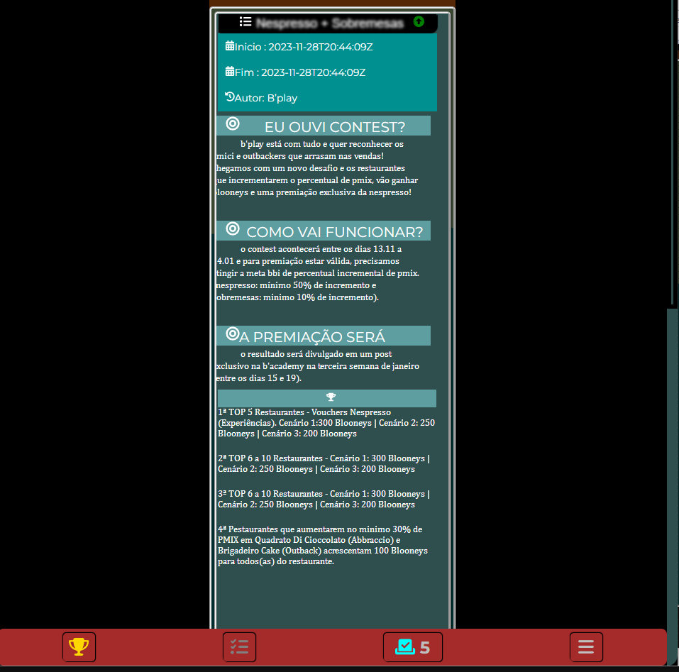

# **📱 Eleição Funcionário do Mês**
<div align="center" >
Este projeto visa criar um aplicativo interno para votação do "Funcionário do Mês" em um ambiente corporativo, promovendo o reconhecimento e a valorização dos colaboradores. As principais características são:
</div>
</br>

## 🚀 Votação Interativa:

> - **Status:** OK
> - **Versão:** 1.6I

### :memo: Objetivos do Projeto:

> - ✔ Promover um ambiente de reconhecimento e valorização dos colaboradores.
> - ✔ Estimular a interação e o engajamento entre os membros da equipe.
> - ✔ Reforçar a cultura corporativa positiva através do reconhecimento mensal.
> - ✔ Proporcionar transparência no processo de votação e resultados.

<br/>


### Tecnologias Utilizadas:

**Dependências Necessárias:**
- Node.js LTS v16 (ou qualquer versão superior)

- Node.js LTS v16 (ou qualquer versão superior)

Após ter o Node.js Instalado, execute o seguinte comando na pasta raiz do projeto:

```bash
npm install
```

para rodar o projeto localmente, use o seguinte comando:

```bash
npm start
```

<p align="left">
A aplicação será desenvolvida utilizando React para criar interfaces interativas e responsivas. Além disso:

- Um banco de dados será implementado para armazenar votos e informações dos funcionários.
- Restrições de votação serão controladas por lógica de backend, assegurando a integridade dos resultados.

## 📜 Notas

### Bibliotecas e Frameworks Principais:

1. **@emotion/react (^11.11.1) e @emotion/styled (^11.11.0):**
   - Bibliotecas de estilo para React, simplificando a criação de estilos eficientes.

2. **@fortawesome/fontawesome-svg-core (^6.4.2), @fortawesome/free-solid-svg-icons (^6.4.2) e @fortawesome/react-fontawesome (^0.2.0):**
   - Fornece ícones FontAwesome para a interface do usuário, permitindo inclusão fácil e personalizada de ícones em componentes.

3. **@mui/icons-material (^5.14.16):**
   - Conjunto de ícones Material-UI para uso na interface, facilitando a integração de ícones consistentes com o design Material.

4. **@reduxjs/toolkit (^1.9.7), redux (^4.2.1) e react-redux (^8.1.3):**
   - Ferramentas para gerenciamento de estado global na aplicação React, facilitando a implementação de lógica de estado compartilhado entre componentes.

5. **@testing-library/jest-dom (^5.17.0), @testing-library/react (^13.4.0) e @testing-library/user-event (^13.5.0):**
   - Facilita a realização de testes unitários em componentes React, proporcionando utilidades para interação e teste de componentes.

6. **@types/gsap (^3.0.0):**
   - Tipos TypeScript para a biblioteca GSAP (GreenSock Animation Platform), melhorando a integração e segurança durante o desenvolvimento.

7. **@types/jest (^27.5.2), @types/node (^16.18.60), @types/react (^18.2.35), @types/react-dom (^18.2.14) e @types/react-redux (^7.1.28):**
   - Tipos TypeScript para Jest, Node.js, React, ReactDOM e React-Redux, respectivamente. Adiciona suporte de tipos para bibliotecas externas.

8. **axios (^1.6.1):**
   - Cliente HTTP para fazer requisições à API backend, simplificando a comunicação entre o frontend e o backend.

9. **gsap (^3.12.2):**
   - Biblioteca para animações JavaScript, facilitando a criação de animações fluidas e atraentes.

10. **qrcode.react (^3.1.0):**
    - Componente React para gerar códigos QR, utilizado para a geração de códigos QR relevantes no contexto do projeto.

11. **react (^18.2.0) e react-dom (^18.2.0):**
    - Bibliotecas principais do React para a construção de interfaces de usuário declarativas e reativas.

12. **react-icons (^4.11.0):**
    - Conjunto de ícones para uso em projetos React, fornecendo uma variedade de ícones populares prontos para uso.

13. **react-router-dom (^6.18.0):**
    - Facilita a navegação e o roteamento em aplicações React, utilizado para a criação de diferentes telas no aplicativo.

14. **react-scripts (5.0.1):**
    - Scripts para facilitar o desenvolvimento React, incluindo ferramentas para iniciar, compilar e testar o aplicativo.

15. **redux-devtools-extension (^2.13.9):**
    - Extensão para navegador que fornece ferramentas de desenvolvedor Redux, facilitando o rastreamento e a depuração do estado Redux.

16. **redux-thunk (^2.4.2):**
    - Middleware para aplicativos Redux que permite ações assíncronas, utilizado para lidar com lógica assíncrona, como chamadas de API.

17. **three (^0.158.0):**
    - Biblioteca para criação de gráficos 3D na web, potencialmente utilizado para elementos visuais ou animações tridimensionais.

18. **ts-std (^0.7.0) e typescript (^4.9.5):**
    - Biblioteca TypeScript padrão para desenvolvimento, oferecendo tipos e utilitários adicionais para melhorar a experiência de desenvolvimento em TypeScript.

19. **web-vitals (^2.1.4):**
    - Biblioteca para medir métricas de desempenho da web, ajudando a monitorar e melhorar a experiência do usuário.
</p>
</br>


</br>
<p align="left"> 
  <a href="https://developer.mozilla.org/en-US/docs/Web/JavaScript" target="_blank">
    
  </a>
  <a href="https://developer.mozilla.org/pt-BR/docs/Web/CSS" target="_blank">
    
  </a>

  <a href="https://developer.mozilla.org/pt-BR/docs/Web/HTML" target="_blank">
    
  </a>

</p>
## :mortar_board: Autores

<table align="center">
    <tr>
        <td align="center">
            <a href="https://github.com/davidsongsc">
                
                <br />
                <sub><b>Davidson George</b></sub>
            </a>
        </td>    
    </tr>
</table>
<h4 align="center">
  linkedin <a href="https://www.linkedin.com/in/davidsongsc/" target="_blank"> Davidson George </a>
</h4>
